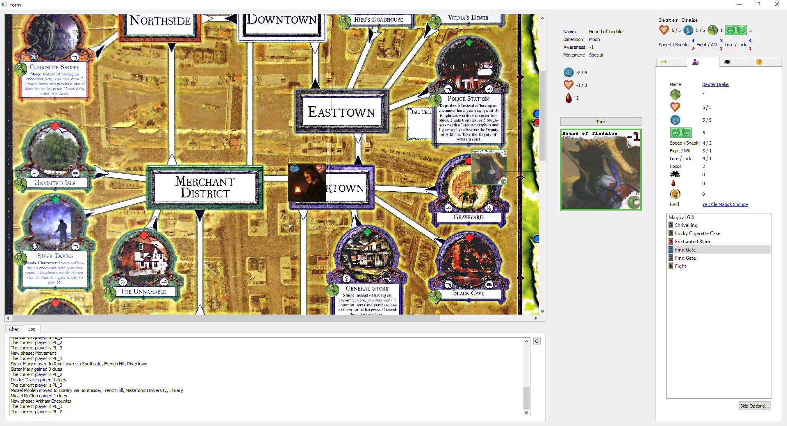
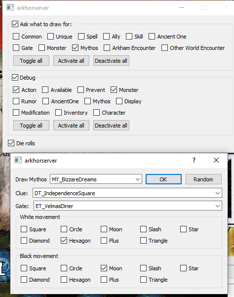
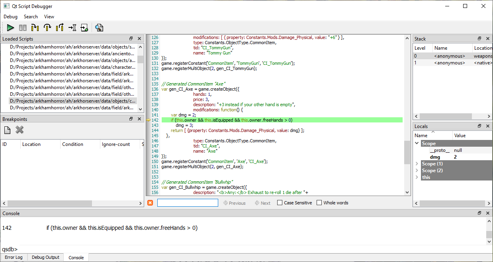

# Arkham Horror
This project is an implementation of the board game [Arkham Horror](http://www.arkhamhorrorwiki.com/).

It is multiplayer, network based, and fully scriptabale (items, monsters, events, etc.)

## Scripting
Every piece of the game is scriptable, from Weapons, Abilities, Investigators, Ancieant Ones, Events, Locations, etc.

The script is done in an own ArkhamHorror Script Language (that is compiled to JavaScript).
It is supposed to be straight forward for simple things, while allowing complex interaction in the game.

    Monster Zombie : 3 { // 3 Zombies in game
	  description: "An undead creature";
	  horrorDamage: 2;
	  horrorAdjustment: -1;
	  combatDamage: 3;
	  combatAdjustment: 1;
	  toughness: 2;
	  attirbutes: ( MagicalResistance, Undead );
	  onDefeat: {{{
	    if (chr.skillTest("Search the dead undead", this.id, Constants.Skills.Luck, -1, 1)) {
		  chr.addClue(1);
		} else {
		  chr.damageStamina(1);
		}
	  }}};
	}
	
## Testing & Debugging
The server can be compiled in a way to choose the outcome of any random event in the game, from which monsters to spawn, what items to find, to which dice to roll.

It also comes with a debugger for custom functions in the script

